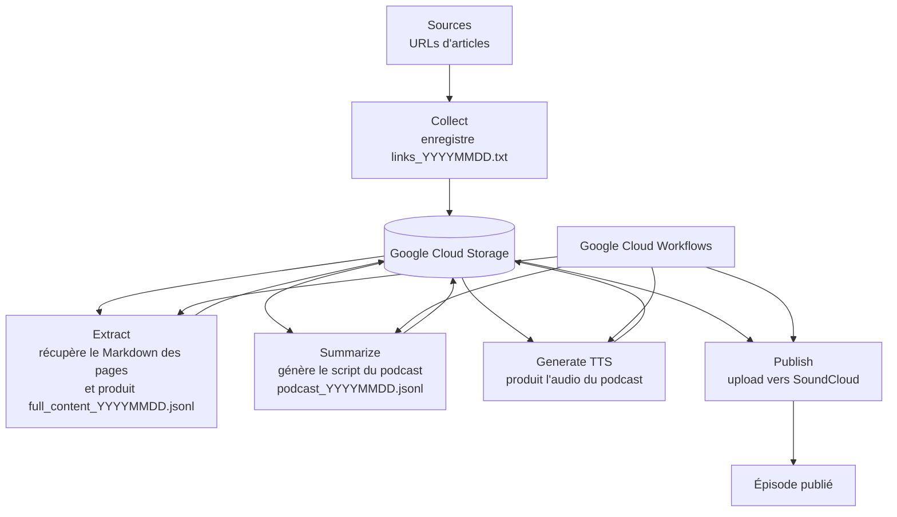

# Techwatcher

Techwatcher est une pipeline de revue de presse automatisée qui transforme une liste de liens web en podcast audio publiable. Le projet récupère des articles, extrait leur contenu, génère un script de podcast, synthétise l'audio en TTS, puis publie le résultat sur SoundCloud.

Le dépôt est pensé pour tourner en mode local ou en mode serverless sur Google Cloud. Le stockage intermédiaire est centralisé dans Google Cloud Storage.

## Vue d'ensemble

Fonctionnement du pipeline:



## Exécution directe (Windows)

La solution est GCS-only. Toutes les étapes lisent/écrivent dans Google Cloud Storage.

### 1. Créer `techwatcher/.env`

```dotenv
# Security
SECRET_API_KEY=<your-secret-api-key>

# Google Cloud workflow and storage
GOOGLE_CLOUD_PROJECT=<your-google-cloud-project>
WORKFLOW_LOCATION=<your-workflow-location>
WORKFLOW_NAME=<your-workflow-name>
BUCKET_NAME=<your-gcs-bucket>

# LLM providers
LLM_PROVIDER=google_ai_studio
LLM_MODEL=gemini-3.1-flash-lite-preview
GOOGLE_API_KEY=<optional-google-api-key>
MISTRAL_API_KEY=<optional-mistral-api-key>

# TTS generation
TTS_PROVIDER=google_ai_studio
TTS_MODE=mono
TTS_MODEL=
VOICE_ID=
SPEAKER1_NAME=Anna
SPEAKER2_NAME=Hugo
SPEAKER1_VOICE=Zephyr
SPEAKER2_VOICE=Puck
SOUNDTRACK_TITLE_PREFIX=Techwatch

# SoundCloud API and token storage
TOKEN_ENDPOINT=https://api.soundcloud.com/oauth2/token
TRACK_UPLOAD_ENDPOINT=https://api.soundcloud.com/tracks
SOUNDCLOUD_CLIENT_ID=<your-soundcloud-client-id>
SOUNDCLOUD_CLIENT_SECRET=<your-soundcloud-client-secret>
SOUNDCLOUD_TOKEN_BLOB=soundcloud-token.json
```

Options supportées:
- `LLM_PROVIDER`: `google_ai_studio`.
- `TTS_MODE`: `mono` ou `multi`.

Valeurs par défaut:
- `TTS_MODEL`: si la variable est vide, la valeur par défaut dépend de `TTS_PROVIDER`.
  - `TTS_MODEL` avec `TTS_PROVIDER=google_ai_studio`: `gemini-3.1-flash-tts-preview`. Voir les modèles disponibles dans la [doc Google TTS](https://ai.google.dev/gemini-api/docs/speech-generation#supported-models).
  - `TTS_MODEL` avec `TTS_PROVIDER=mistral`: `voxtral-mini-tts-2603`. Voir les modèles disponibles sur la [page Voxtral TTS](https://docs.mistral.ai/models/voxtral-tts-26-03/).
- `VOICE_ID`: si la variable est vide, la valeur par défaut dépend de `TTS_PROVIDER`.
  - `VOICE_ID` avec `TTS_PROVIDER=google_ai_studio`: `Charon`. 
  - `VOICE_ID` avec `TTS_PROVIDER=mistral`: `fr_marie_curious`.

Contraintes:
- `LLM_PROVIDER=google_ai_studio` est actuellement la seule valeur supportée par l'étape summarize.
- `TTS_MODE=mono` génère une seule voix et fonctionne avec `TTS_PROVIDER=google_ai_studio` ou `TTS_PROVIDER=mistral`.
- `TTS_MODE=multi` active le mode 2 speakers et n'est supporté qu'avec `TTS_PROVIDER=google_ai_studio`.
- En mode `mono`, `VOICE_ID` est utilisé pour choisir la voix.
- En mode `multi`, `VOICE_ID` n'est pas utilisé. Ce sont `SPEAKER1_NAME`, `SPEAKER2_NAME`, `SPEAKER1_VOICE` et `SPEAKER2_VOICE` qui pilotent la génération.
- En mode `multi`, les variables `SPEAKER1_NAME`, `SPEAKER2_NAME`, `SPEAKER1_VOICE` et `SPEAKER2_VOICE` doivent être cohérentes avec le script produit à l'étape summarize.

`SECRET_API_KEY` reste obligatoire pour les endpoints HTTP cloud. Les exécutions via [local_step_runner.py](local_step_runner.py) appellent directement le métier et ne passent pas par cette vérification HTTP.

### 2. Charger le `.env`

```powershell
. .\load-env.ps1
```

### 3. Lancer une étape sans passer par HTTP

Le script [local_step_runner.py](local_step_runner.py) appelle directement les fonctions métier des étapes.

Exemples:

```powershell
python .\local_step_runner.py collect --url "https://example.com/article"
python .\local_step_runner.py extract --date 20260308
python .\local_step_runner.py summarize --date 20260308
python .\local_step_runner.py generate --date 20260308
python .\local_step_runner.py publish --date 20260308
```

Lancer une chaîne complète:

```powershell
python .\local_step_runner.py pipeline --date 20260308
```

Lancer une chaîne partielle:

```powershell
python .\local_step_runner.py pipeline --from-step summarize --to-step publish --date 20260308
```

### 4. Vérification rapide

```powershell
python .\local_step_runner.py extract --date 20260308
python .\local_step_runner.py summarize --date 20260308
python .\local_step_runner.py generate --date 20260308
```

Sorties attendues (blobs dans le bucket GCS) selon l'étape ou la chaîne lancée:
- `links_YYYYMMDD.txt` 
- `full_content_YYYYMMDD.jsonl` 
- `fetch_errors_YYYYMMDD.jsonl`
- `podcast_YYYYMMDD.jsonl` 
- `podcast_YYYYMMDD.wav` 

## Exécution cloud (HTTP)

Collect :

```bash
curl -X POST "https://<your-collect-endpoint>" -H "X-API-Key: $env:SECRET_API_KEY" -H "Content-Type: application/json" -d "https://example.com"
```

Autres steps 

```bash
curl -X POST "https://<your-step-endpoint>" -H "X-API-Key: $env:SECRET_API_KEY" -H "Content-Type: application/json" -d "{}"
```

Workflow:

```bash
curl -X POST "https://<your-workflow-endpoint>" -H "X-API-Key: $env:SECRET_API_KEY" -H "Content-Type: application/json" -d '{"date":"20260314"}'
```

Le workflow déclenche ensuite les étapes extract, summarize, generate et publish dans Google Cloud Workflows.

## SoundCloud token store (GCS)

Le publish utilise un `refresh_token` sécurisé persisté en GCS.

Prérequis:
- le compte de service qui exécute `5_publish/publish.py` doit pouvoir lire/écrire le blob token dans le bucket (`storage.objects.get` et `storage.objects.create/update`).
- le blob est configuré via `SOUNDCLOUD_TOKEN_BLOB` (par défaut `soundcloud-token.json`).

### Refresh automatique via endpoint HTTP

Un endpoint dédié est disponible dans `5_publish/refresh_soundcloud_token.py` pour faire tourner le token sans uploader un épisode.
